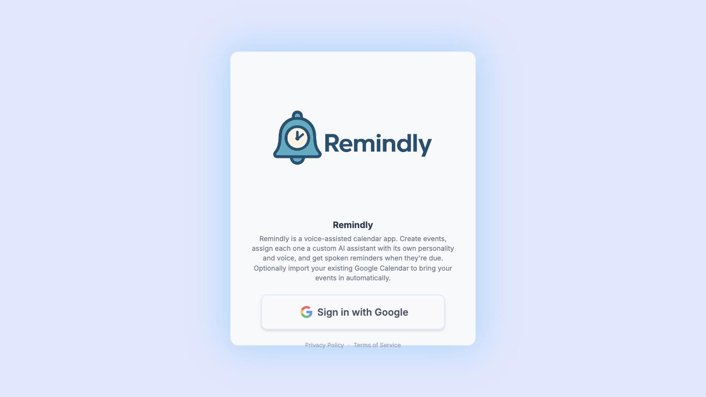

# Remindly

A calendar app where every event can have its own AI assistant — a persona with a
name, role, emotion, and voice — that speaks a custom reminder out loud shortly
before the event happens.

**Live app:** https://remindly-web.web.app



## What it does

- Create events on a full month/week/day/agenda calendar (built on
  `react-big-calendar`).
- Create "assistants" — pick a role (Drill Sergeant, Pirate Captain, News Anchor,
  Wizard, and 30+ others), an emotion, a voice, and an optional photo — and assign
  one to any event.
- When a reminder is due, the backend asks Gemini to write a short, in-character
  spoken script for that specific event, then synthesizes it with Gemini TTS. The
  audio plays automatically at notification time; if generation isn't ready in
  time, a default ring plays instead so a reminder is never late because of AI.
- Sign in with Google and optionally import your existing Google Calendar events
  (read-only, one-time import, deduplicated on re-import).

## How it's built

**Frontend:** React 19 + Vite, Tailwind CSS v4, no router (a single auth-gated
state switch between the login screen and the calendar). Client-side polling
(`useReminderScheduler`) checks events every ~12s and kicks off script/audio
generation ahead of each reminder's notification time.

**Backend:** Firebase Cloud Functions (v2, Node 22). Two HTTPS endpoints —
`generateScript` and `tts` — hold the Gemini API key as a server secret (never
shipped to the browser), are gated behind Firebase Auth token verification and a
per-user rate limit (Firestore transaction, fixed window), and cap input length to
bound worst-case cost. Two Firestore-trigger functions clean up orphaned audio
files and profile photos in Storage when their parent doc is deleted.

**Data:** Firestore (`users/{uid}/assistants`, `users/{uid}/events`), scoped by
per-user security rules. Firebase Storage for generated audio and uploaded
assistant photos, also scoped per-user. Google Sign-In via Firebase Auth, with a
narrowly-scoped read-only Calendar OAuth scope for the import feature.

See [`client/CLAUDE.md`](client/CLAUDE.md) for the detailed architecture/schema
reference and [`client/TTS_BACKEND.md`](client/TTS_BACKEND.md) for the TTS
endpoint's request/response contract.

## Tech stack

React · Vite · Tailwind CSS v4 · Firebase (Auth, Firestore, Storage, Cloud
Functions) · Google Gemini (text + TTS) · Google Calendar API · `react-big-calendar`
· `date-fns`

## Running it locally

```bash
cd client
npm install
npm run dev      # http://localhost:5173
```

You'll need a `client/.env` with your own Firebase project config and Cloud
Function endpoint URLs (see the `import.meta.env.VITE_*` reads in
`src/generateScript.js` and `src/services/tts.js`). The Cloud Functions
themselves live in `functions/` and deploy with `firebase deploy --only functions`
(requires a `GEMINI_API_KEY` set via `firebase functions:secrets:set`).

## Status

Actively developed, single-author project. No automated test suite is wired up
yet (see `client/CLAUDE.md`); reminder delivery currently requires the app tab to
be open (client-side polling, not push-based).
